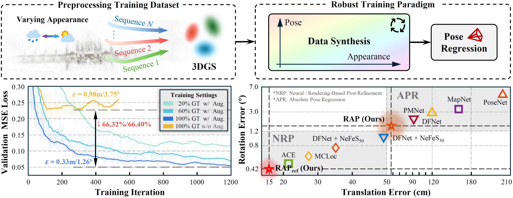

<p align="center">
  <h1 align="center">😎 RAP<br>Unleashing the Power of Data Synthesis <br> in Visual Localization </h1>
  <h3 align="center">ICCV 2025</h3>
  <p align="center">
    <a href="https://scholar.google.com/citations?user=90IoeJsAAAAJ">Sihang Li*</a>
    ·
    <a href="https://github.com/kevintsq">Siqi Tan*</a>
    ·
    <a href="https://karlcbw.github.io/">Bowen Chang</a>
    ·
    <a href="https://scholar.google.com/citations?hl=zh-CN&user=fRGFTaEAAAAJ">Jing Zhang</a>
    ·
    <a href="https://scholar.google.com/citations?hl=en&user=YeG8ZM0AAAAJ">Chen Feng</a>
    ·
    <a href="https://scholar.google.com/citations?user=i_aajNoAAAAJ">Yiming Li</a>
  </p>
  <p align="center">
    * Equal contribution
  </p>
  <h2 align="center">
    <a href="https://ai4ce.github.io/RAP/static/RAP_Paper.pdf">Paper</a> | 
    <a href="https://ai4ce.github.io/RAP/">Project Page</a>
  </h2>
  <div align="center"></div>
<br/>
<p align="center">
    <!-- <video width="100%" controls>
        <source src="./assets/hospital.mp4" type="video/mp4">
        Your browser does not support the video tag.
    </video> -->
    
    <br>
    <em>TLDR: We make camera localization more generalizable by addressing the data gap via 3DGS and learning gap via a two-branch joint learning with adversarial loss, achieving localization accuracy surpassing 1cm/0.3° in indoor scenarios, 20cm/0.5° in outdoor scenarios, and 10cm/0.2° in driving scenarios.</em>
</p>

## 🔊 News

- 2025/6/25: Our paper is accepted to ICCV 2025! 🎉 Code is released! Data and checkpoints will be released as soon as we have access to the server that has been undergoing maintenance. The latest results in the paper will also be updated soon.
- 2024/12/1: Our paper is now available on [arXiv](https://arxiv.org/abs/2412.00138)!

## ⚙️ Setup

The current implementation stores the entire training set in memory, requiring approximately 16GB of RAM (training 3DGS on the office scene with depth regularization may require more than 64GB).

Running RAP on a single device requires a CUDA-compatible GPU, with 24GB VRAM recommended.

We also support training RAPNet and rendering 3DGS in parallel on different devices. If you choose to do so, ensure that `args.device != args.render_device`. This is the default behavior when using the BRISQUE score to filter out low-quality rendered images (i.e., `args.brisque_threshold != 0`). The current implementation calculates the BRISQUE score on the CPU due to its better SVM model, which, despite optimizations achieving ~70 FPS, remains slower than a GPU version.

In theory, RAPNet can be trained on devices other than NVIDIA GPUs, but this has not been tested. Still, rendering 3DGS requires a CUDA-compatible GPU.

Post-refinement requires a CUDA-compatible GPU with at least 6GB of VRAM.

1. Clone the repository in recursive mode as it contains submodules:

   ```sh
   git clone https://github.com/ai4ce/RAP --recursive
   ```

2. Make sure you have an environment with Python 3.11+ and CUDA Toolkit `nvcc` compiler accessible from the command line.

   > If you are on Windows, you need to install Visual Studio with MSVC C++ SDK first, and then install CUDA Toolkit.

3. Make sure PyTorch 2.0 or later is installed in your environment. We recommend PyTorch 2.6+. The CUDA version of PyTorch should match the version used by `nvcc` (check with `nvcc -v`), and should not exceed the version supported by your GPU driver (check with `nvidia-smi`).

   > We use `torch.compile` for acceleration and reducing memory and its `triton` backend only supports Linux. When `torch.compile` is enabled for a module, it will seem to stuck for a while during its first and last forward pass in the first epoch of training and validating depending on how high your CPU's single-core performance is. Windows and older PyTorch versions might work if you set `args.compile_model = False` and make sure `args.compile = False` when you run the code, but it might be buggy, slower, and consume more memory, so it is not recommended.

4. Install packages. This might take a while as it involves compiling two CUDA extensions.

   ```sh
   pip install -r requirements.txt
   ```

   > The original `diff-gaussian-rasterizer` is needed if you want to use inverted depth maps for supervision. Use the following command to build and install:
   >
   > ```sh
   > pip install "git+https://github.com/graphdeco-inria/diff-gaussian-rasterization.git@dr_aa"
   > ```
   >
   > `pytorch3d` is needed if you want to use Bezier interpolation when training deblurring Gaussians. Use the following command to build and install:
   >
   > ```shell
   > pip install "git+https://github.com/facebookresearch/pytorch3d.git@stable"
   > ```

## 📦 Data (Coming Soon)

| Name                           | Dataset                                                      | COLMAP                 | 3DGS                       | Weights |
| ------------------------------ | ------------------------------------------------------------ | ---------------------- | -------------------------- | ------- |
| Cambridge Landmarks            | `utils/setup_cambridge.py` (In fact, only COLMAP is needed)  | (Undistorted)          |                            |         |
| 7Scenes (SfM)                  | Only COLMAP is needed                                        |                        |                            |         |
| 7Scenes (DSLAM, Deprecated)    | [Download](https://www.microsoft.com/en-us/research/project/rgb-d-dataset-7-scenes/) | (Training Set Only)    |                            |         |
| MARS                           | Only COLMAP is needed                                        | (Not in metric scale*) |                            |         |
| St. George’s Basilica Building | Only COLMAP is needed                                        |                        | (Trained with testing set) |         |
| Aachen Subset                  | Only COLMAP is needed                                        | (Not in metric scale)  |                            |         |

*Scale multipliers for MARS:

| Sequence   | 11     | 15     | 37      | 41   |
| ---------- | ------ | ------ | ------- | ---- |
| Multiplier | 7.2162 | 6.6005 | 7.68605 | 7.67 |

### 🛠️ Custom Datasets

You can place all images (including both the training and test sets) in an images folder and use `utils/run_colmap.sh` (Linux) or `utils/run_colmap.ps1` (Windows) to convert them into a COLMAP-format dataset. Ensure that all images are the same size and captured with the same camera using a fixed focal length. When running `colmap feature_extractor`, set `--ImageReader.single_camera 1`; otherwise, ambiguities may arise during translation estimation, since our model does not have access to focal length information.

To specify the test set, create a `list_test.txt` file in the same directory as the `images` and `sparse` folders.

We recommend using SfM poses to train 3DGS, as poor camera poses can significantly degrade rendering quality. If you have GPS/IMU data, you can either compute a scale factor to convert translations to metric units or apply a transformation matrix after training to align the output with the real-world coordinate system, since COLMAP outputs are not in metric scale.

## 🎨 Training, Rendering, and Evaluating 3DGS

```sh
python gs.py -s /path/to/colmap/data -m /path/to/output
```

Useful arguments include: `white_background`, `eval`, `train_fraction`, `antialiasing`, `use_masks`, `iterations`, `position_lr_final`, `position_lr_max_steps`, `percent_dense`, `densify_until_iter`, `densify_grad_threshold`, `use_depth_loss`, `depth_is_inverted`, `deblur`, `prune_more`.

If you want to use depth supervision for datasets that do not come with metric depths, please following the instructions provided [here](https://github.com/graphdeco-inria/gaussian-splatting#depth-regularization). Training will be slower, and we do not observe much benefits in our subsequent APR.

> Note that for 3DGS-related arguments, only `-s, --source_path` and `-m, --model_path` will be taken from the command line when running `render.py`, `rap.py`, and `refine.py`. Other arguments will be loaded from `cfg_args` in the 3DGS model directory. If you want to change some arguments, you may just edit the `cfg_args` file, or assign values in the code.

## 🚀 Running RAP

```sh
python rap.py -c configs/actual_config_file.txt -m /path/to/3dgs
```

See `arguments/options.py` for arguments usage.

Due to uncontrollable randomness, the computation order of floating-point numbers may vary across different devices, batch sizes, and whether the model is compiled, potentially leading to results that differ from those reported in the paper.

## 🤩 RAP<sub>ref</sub> Post Refinement

```sh
python refine.py -c configs/actual_config_file.txt -m /path/to/3dgs
```
Post-refinement is more CPU-intensive than other tasks.

## 🙏 Acknowledgement

This work was supported in part through NSF grants 2238968, 2121391, and 2024882, and the NYU IT High Performance Computing resources, services, and staff expertise. Yiming Li is supported by NVIDIA Graduate Fellowship.

This repo is built on [Gaussian-Wild](https://github.com/EastbeanZhang/Gaussian-Wild), [Deblur-GS](https://github.com/Chaphlagical/Deblur-GS), and [DFNet](https://github.com/ActiveVisionLab/DFNet), with a major refactor for efficiency, maintainability, and scalability. [MASt3R](https://github.com/naver/mast3r) should have been organized as a submodule, but due to import path issues, it is copied to the root directory of our repo. Thanks for their great work!

## 📚 BibTeX
If you find our work helpful, please consider citing our paper!
```
@inproceedings{Li2025unleashing,
 title={Unleashing the Power of Data Synthesis},
 author={Sihang Li and Siqi Tan and Bowen Chang and Jing Zhang and Chen Feng and Yiming Li},
 year={2025},
 booktitle={International Conference on Computer Vision (ICCV)}
}
```